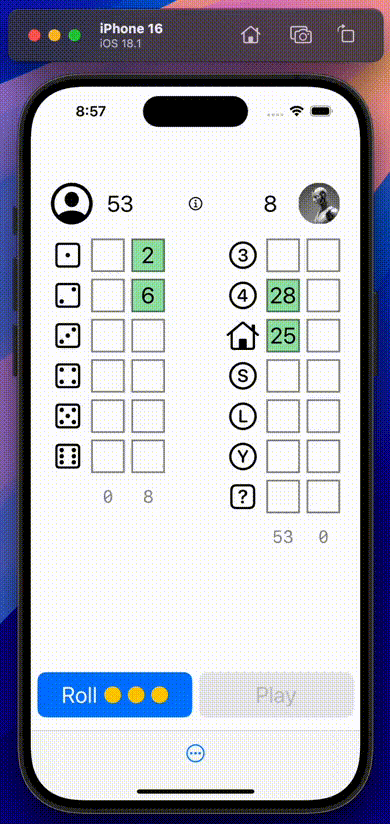

# Yahtzee
I really like playing Yahtzee on my phone when I have a minute. Just for fun, I developed this Yahtzee game app for iOS.

The app is built with SwiftUI. The dice are rendered with SceneKit.

You play against a "bot" opponent. There are three different bots, with different skill levels, available to play against.

This is a work-in-progress. It's pretty "bare-bones" right now.

